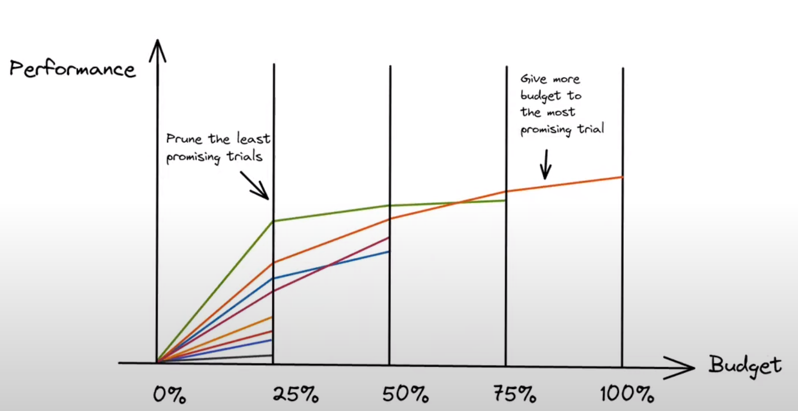

Deep Q-Learning

The problem is that Q-Learning is a tabular method. This becomes a problem if the states and actions spaces are not small enough to be represented efficiently by arrays and tables. In other words: it is not scalable.

That’s why, to capture temporal information, we stack four frames together.

in Deep Q-Learning, we create a loss function that compares our Q-value prediction and the Q-target and uses gradient descent to update the weights of our Deep Q-Network to approximate our Q-values better.

The Deep Q-Learning training algorithm has two phases:

- Sampling: we perform actions and store the observed experience tuples in a replay memory.
- Training: Select a small batch of tuples randomly and learn from this batch using a gradient descent update step.

Deep Q-Learning training might suffer from instability, mainly because of combining a non-linear Q-value function (Neural Network) and bootstrapping (when we update targets with existing estimates and not an actual complete return).

To help us stabilize the training, we implement three different solutions:

- Experience Replay to make more efficient use of experiences.
- Fixed Q-Target to stabilize the training.
- Double Deep Q-Learning, to handle the problem of the overestimation of Q-values.

## Experience Replay

1- Experience replay helps by using the experiences of the training more efficiently. We use a replay buffer that saves experience samples that we can reuse during the training.
This allows the agent to learn from the same experiences multiple times.

2- Avoid forgetting previous experiences (aka catastrophic interference, or catastrophic forgetting) and reduce the correlation between experiences.

The solution is to create a Replay Buffer that stores experience tuples while interacting with the environment and then sample a small batch of tuples. This prevents the network from only learning about what it has done immediately before.

Experience replay also has other benefits. By randomly sampling the experiences, we remove correlation in the observation sequences and avoid action values from oscillating or diverging catastrophically.

## Fixed Q-Target to stabilize the training
When we want to calculate the TD error (aka the loss), we calculate the difference between the TD target (Q-Target) and the current Q-value (estimation of Q).

But we don’t have any idea of the real TD target. We need to estimate it. Using the Bellman equation, we saw that the TD target is just the reward of taking that action at that state plus the discounted highest Q value for the next state.

However, the problem is that we are using the same parameters (weights) for estimating the TD target and the Q-value. Consequently, there is a significant correlation between the TD target and the parameters we are changing.

Therefore, at every step of training, both our Q-values and the target values shift. We’re getting closer to our target, but the target is also moving. It’s like chasing a moving target! This can lead to significant oscillation in training.

## Double DQN
Double DQNs, or Double Deep Q-Learning neural networks, were introduced by Hado van Hasselt. This method handles the problem of the overestimation of Q-values.

when we compute the Q target, we use two networks to decouple the action selection from the target Q-value generation.
Double DQN helps us reduce the overestimation of Q-values and, as a consequence, helps us train faster and with more stable learning.

# Tabular Method
Type of problem in which the state and action spaces are small enough to approximate value functions to be represented as arrays and tables. Q-learning is an example of a tabular method since a table is used to represent the value for different state-action pairs.

# Deep Q-Learning
Method that trains a neural network to approximate, given a state, the different Q-values for each possible action at that state. It is used to solve problems when the observational space is too big to apply a tabular Q-Learning approach.

## Temporal Limitation
A difficulty presented when the environment state is represented by frames. A frame by itself does not provide temporal information. In order to obtain temporal information, we need to stack a number of frames together.

## Phases of Deep Q-Learning:
1. **Sampling:** Actions are performed, and observed experience tuples are stored in a replay memory.
2. **Training:** Batches of tuples are selected randomly, and the neural network updates its weights using gradient descent.

## Solutions to Stabilize Deep Q-Learning:
- **Experience Replay:** A replay memory is created to save experience samples that can be reused during training. This allows the agent to learn from the same experiences multiple times and helps avoid forgetting previous experiences.
  - Random sampling from the replay buffer allows removing correlation in the observation sequences and prevents action values from oscillating or diverging catastrophically.
- **Fixed Q-Target:** To calculate the Q-Target, we need to estimate the discounted optimal Q-value of the next state using the Bellman equation. The issue is that the same network weights are used to calculate the Q-Target and the Q-value. To avoid this problem, a separate network with fixed parameters is used for estimating the Temporal Difference Target. The target network is updated by copying parameters from our Deep Q-Network after a certain number of steps (C steps).
- **Double DQN:** A method to handle the overestimation of Q-Values. This solution uses two networks to decouple the action selection from the target Value generation:
  - **DQN Network:** Selects the best action to take for the next state (the action with the highest Q-Value).
  - **Target Network:** Calculates the target Q-Value of taking that action at the next state. This approach reduces Q-Values overestimation, helps train faster, and ensures more stable learning.

## AUTOMATIC HYPERPARAMETER TUNING WITH OPTUNA
One of the most critical tasks in Deep Reinforcement Learning is to find a good set of training hyperparameters.

Optuna is a library that helps you to automate the search. In this Unit, we’ll study a little bit of the theory behind automatic hyperparameter tuning.

main two components of hyperparameters tuning optimization are:
- sampler (search algo)
- pruner (scheduler)

### sampler:
- Grid Search: This involves defining a grid of hyperparameter values and searching exhaustively through the grid to find the best combination.
- Random Search: Randomly selects combinations of hyperparameter values and evaluates their performance.
- Bayesian Optimization: Utilizes probabilistic models to predict the performance of different hyperparameter configurations and selects the next configuration to evaluate based on these predictions.
- black box optimization: example ( evolution strategies - particle swarm optimization)

### Pruner:
- Median Pruner
- successive halving

## Additional Readings

[Intro to Deep Learning with PyTorch](https://www.udacity.com/course/deep-learning-pytorch--ud188)

[High-quality single file implementation of Deep Reinforcement Learning algorithms](https://github.com/vwxyzjn/cleanrl/tree/master)

[cuda tutorial](https://cuda-tutorial.github.io/)